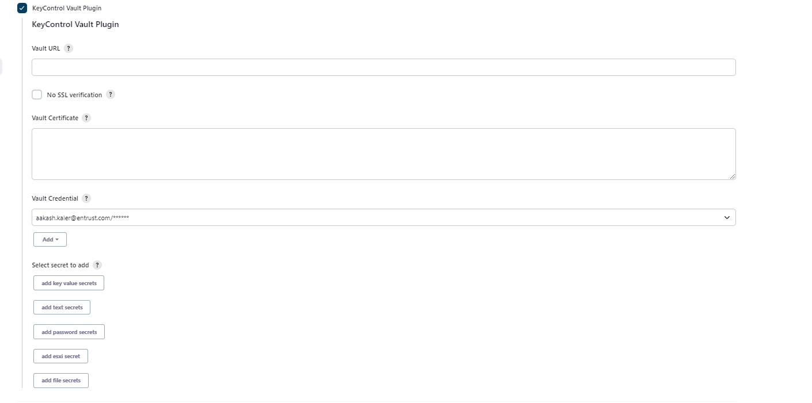
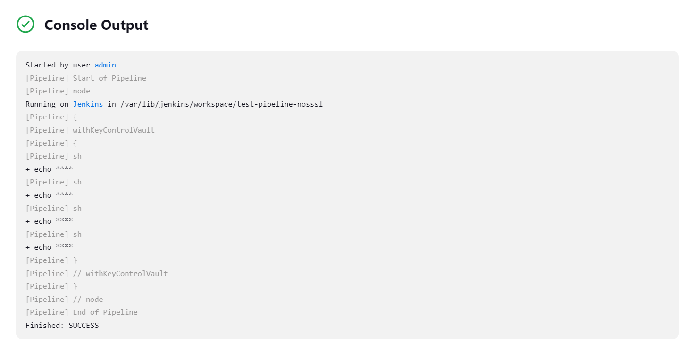

# KeyControl Secrets Vault Plugin for Jenkins

## Introduction
The KeyControl Secrets Vault Plugin is used to fetch a key-value type secret from the KeyControl Secrets Vault and import the secret into the Jenkins Environment variable, for use in builds.

# CONFIGURATION

## Vault configuration
### 1 Secret must be key value type
### 2 Secret must contain only one key value pair

## Configuration if using the KeyControl Secrets Vault for the first time
If using KeyControl Secrets Vault for the first time, you must add the CA Certificate in the java keystore (otherwise you will see an SSL Sunrise error).

Command to add CA Certificate in java keystore:

    WARNING: If multiple instances of java are installed, use the path of java that mvn is using. Use command mvn 
    version to check which java mvn is using

    Default password of keystore of java 

      'changeit'

    Deafult location of keystore in windows

        C:\Program Files\Java\jdk1.8.0_231\jre\lib\security\cacerts

        WARNING: Path should be of same java jdk that added in path of window environment variable 
     
    Deafult location of keystore in Linux machine
            
        usr/lib/jvm/java-1.11.0-openjdk-amd64/lib/security/cacerts

    Standard Command to cacert in java keystore

        keytool -import -alias <alias-name> -keystore <path-to-java(JAVA_HOME)-cacert-file> -file <ca-cert-path+name-that-need-to-be-added>
    
    Sample for windows

        keytool -import -alias kccacerti -keystore "C:\Program Files\Java\jdk1.8.0_231\jre\lib\security\cacerts" -file <path>\kccacerti.pem

    Sample for Linux machine

        keytool -import -alias kccacerti1 -keystore usr/lib/jvm/java-1.11.0-openjdk-amd64/lib/security/cacerts -file opt/cacert.pem
    
    Command to update certificate :- add command work as both add and update, it will override the previous certificate

    Command to delete/remove certificate

        keytool -delete -alias <alias-name-of-certificate-that-you-want-to-delete> -keystore <path-to-java(JAVA_HOME)-cacert-file>

        WARNING: If after adding if still getting sll certificate error try to restart server. 

## Install KeyControl Secrets Vault Plugin

Step1: Navigate to the Jenkins Dashboard and select **Manage Jenkins**.

Step2: Select **Manage Plugins**

Step3: Select **Advanced**

Step 4: Navigate to Deploy Plugin. Select **Choose File** and select the *KeyControl.hpi* file from plugin target folder.
Click **Deploy**.

Step 5: After selecting Deploy, the installation starts. If an error is shown, the install should complete after you restart the Jenkins server (a Jenkins server restart is necessary to complete the installation).

Step 6: Navigate to installed plugins to check the KeyControl Vault Plugin is shown in the list.

## How to use KeyControl Secrets Vault Plugin in Freestyle

Step 1: Open the Freestyle project. 

Step 2: In the Build Environment select the KeyControl Secrets Vault Plugin.

Step 3: Add the required details and select **Save**.
 
### vault url 
Locate the Tenant API URL entry and select **Copy Full URL**. 

### Box name and secret name

     
### Version
Version of secret.

### Key Name for username
Jenkins environment variable name for the secret username.

### Key Name for password
Jenkins environment variable name for the secret password.

### Vault credentials
Enter your secret vault credentials. Select the credentials.

Step 5: You can use the username and password provided above (Key Name for username and Key Name for password) in your Jenkins build.

### Example

Step 6: Select Save and build now. The console shows the masked value of user and pass.

## How to use KeyControl Secrets Vault Plugin in pipeline job

Step 1: Open Pipeline project. 

Step 2: In Pipeline, select **Pipeline Syntax**

Step 3: In Sample Step, search for withKeyControlVault and enter required value.

### vault url 
Locate the Tenant API URL and select **Copy Full URL**.

### Box name and secret name

     
### Version
Version of secret

### Key Name for username
Jenkins environment variable name for the secret username.

### Key Name for password
Jenkins environment variable name for the secret password.

### Vault credentials
Enter your secret vault credentials. Select the credentials.

Step 4: Select generate script. You can use the script in Pipeline.

 ### Example

 

 

 
