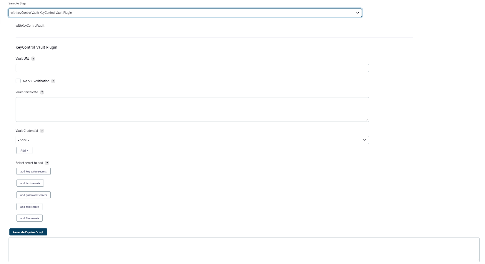

# KeyControl PASM Vault Plugin for Jenkins

## Introduction

The PASM Vault Plugin is used to fetch secrets from the PASM Vault and import the secret into the Jenkins Environment
variable, for use in builds.

## CONFIGURATION

### prerequisite

1) Minimum jenkins version required for plugin to work is **jenkins version 2.387.3**.

2) KCV CA Certificate :- CA Certificate that the external web server of KCV is using. Please refer below link to obtain
   it.
   [How to download certificate ?](https://docs.hytrust.com/KeyControlVault/Online/Content/Books/Admin-Guide/KC-System-Config/Certificates/Downloading-a-KC-Certificate.html)

3) Box Name : box name in which the desired secret is present.

4) Secret Name :- name of the secret that needs to be fetched

5) Vault URL :- Login API URL of vault.The correct format for the API URL should be as follows:- `https://<IP>/vault/1.0/Login/<UUID>/`.Please refer below link to obtain
   [How to get vault Login API URL ?](https://docs.hytrust.com/KeyControlVault/Online/Content/Books/Admin-Guide/Vault-Management/Retrieving-Vault-Details.html)

6) Vault Credentials :- Username and password of PASM vault.

7) ‘Vault User Role’ Access policy configured on the secrets required to be pulled for the user.

### SSL CERTIFICATE CONFIGURATION

### Users can choose any of these options to configure an SSL certificate.

`Note :- The certificate used for SSL verification is the KCV CA Certificate.`

1) Users can directly add a CA certificate in the **Vault Certificate** field of the KeyControl Vault plugin in the build configuration.

`Note:-By directly adding a certificate to the vault certificate field, it will override the Jenkins Java keystore specifically for that build. `

2) User can choose **no SSL Verification**.

`Note :- By opting out of No SSL verification, vault API calls for a specific build will be made without undergoing SSL verification.`
`Note :- No SSL verification is not recommended as it removes a layer of security.`
`Note :- No SSL verfication will override the vault certificate field`

3) User can add the CA Certificate in the java keystore.

Command to add CA Certificate in java keystore:

    WARNING: If multiple instances of java are installed, use the path of java that mvn is using. Use command mvn 
    version to check which java mvn is using

    Default password of keystore of java 

      'changeit'

    Deafult location of keystore in windows

        C:\Program Files\Java\jdk1.8.0_231\jre\lib\security\cacerts

        WARNING: Path should be of same java jdk that added in path of window environment variable 
     
    Deafult location of keystore in Linux machine
            
        usr/lib/jvm/java-1.11.0-openjdk-amd64/lib/security/cacerts

    Standard Command to add cacert in java keystore

        keytool -import -alias <alias-name> -keystore <path-to-java(JAVA_HOME)-cacert-file> -file <ca-cert-path+name-that-need-to-be-added>
    
    Sample for windows

        keytool -import -alias kccacerti -keystore "C:\Program Files\Java\jdk1.8.0_231\jre\lib\security\cacerts" -file <path>\kccacerti.pem

    Sample for Linux machine

        keytool -import -alias kccacerti1 -keystore usr/lib/jvm/java-1.11.0-openjdk-amd64/lib/security/cacerts -file opt/cacert.pem
    
    Command to update certificate :- add command work as both add and update, it will override the previous certificate

    Command to delete/remove certificate

        keytool -delete -alias <alias-name-of-certificate-that-you-want-to-delete> -keystore <path-to-java(JAVA_HOME)-cacert-file>

        WARNING: If after adding if still getting sll certificate error try to restart server. 

## Install KeyContol Vault Plugin

Step1: Navigate to the Jenkins Dashboard and select **Manage Jenkins**.

Step2: Select **Manage Plugins**

Step3: Select **Advanced**

Step 4: Navigate to Deploy Plugin. Select **Choose File** and select the *KeyControl.hpi* file from plugin target
folder.
Click **Deploy**.

Step 5: After selecting Deploy, the installation starts. If an error is shown, the install should complete after you
restart the Jenkins server (a Jenkins server restart is necessary to complete the installation).

Step 6: Navigate to installed plugins to check the KeyControl Vault Plugin is shown in the list.

## Supported types of secrets

`Note :- Multiple secrets Supported for all types of secrets`

`Note :- For pipeline script user can generate script, https://<ip>/jenkins/job/pipeline/pipeline-syntax/`

### Key Value secrets

Please provide the secret name, box name, and key name for the key value secrets.

` Note :- Key name should be same as in PASM vault key-value secret`

` Note :- To retrieve all key-value pairs of single secret , simply omit the key name. All key-value pairs will be fetched with same key name as in the PASM vault.`

#### Example for fetching a key-value pair secrets having multiple pairs in it

Click on `Add Key-value secret` button to add more key-value type secrets.

### Text secrets

Add secret name,box name and Environment Variable Name for text secret value.

Click on `Add text secret` button to add more text type secrets.

### Password secrets

Add secret name,box name and Environment Variable Name for password secret value.

Click on `Add password secret` button to add more password type secrets.

### ESXI secrets

Add secret name,box name and Environment Variable Name for esxi :- username,hostname and password.

Click on `Add esxi secret` button to add more esxi type secrets.

### File secrets

Add secret name,box name and Path to the file to save file secret data.

`Note :- If the mentioned file is not present, it will be created. However, if the path is incorrect, an error will occur.`

`Note :-  Jenkins user should have permission to read or write that particular file.`

Click on `Add file secret` button to add more file type secrets.

`Note :- The user will need to delete the secret explicitly after using it.`

## How to use KeyControl Vault Plugin in Freestyle

Step 1: Open the Freestyle project.
Step 2: In the Build Environment select the KeyControl Vault Plugin.

Step 3: Add the required details and select **Save**.

### vault url

Locate the PASM vault API URL entry in PASM vault UI and select **Copy Full URL**.
The correct format for the API URL should be as follows:- `https://<IP>/vault/1.0/Login/<UUID>/`.

### Vault credentials

`Note :- Credentials stored at the folder level will be available for the jobs within that folder only.`

Enter your secret vault credentials by clicking on add button or Select the credentials from dropdown if already added.

Step 4: Users can now utilize this secret as an environment variable in the build script, and the values of the secrets will be masked in the console output.

## How to use KeyControl Vault Plugin in pipeline job

Step 1: Open Pipeline project.

Step 2: In Pipeline, select **Pipeline Syntax**

Step 3: In Sample Step, search for withKeyControlVault and enter required value.

### vault url

Locate the PASM vault API URL in PASM vault UI and select **Copy Full URL**.
The correct format for the API URL should be as follows:- `https://<IP>/vault/1.0/Login/<UUID>/`.

### Vault credentials

`Note :- Credentials stored at the folder level will be available for the jobs within that folder only.`

Enter your secret vault credentials by clicking on add button or Select the credentials from dropdown if already added.

Step 4: Select generate script. user can use these script in Pipeline.
